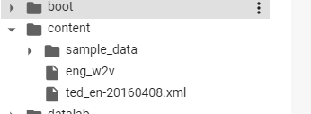

앞어서 `단어 표현(Word Representation)` 에 대해 정리하였지만 이론적인 내용이 대부분이고 실질적으로 어떻게 쓰이는지 알아보기 위해 [딥 러닝을 이용한 자연어 처리 입문](https://wikidocs.net/book/2155){: target="_blank"}을 보고 코드로 실습해본 내용을 정리해 보고자 한다.

첫 실습의 대상은 가장 말이 알려진 `Word2Vec` 이지만 뒤에 포스팅에서 다른 `Distributed Representation` 방법인 `GloVe`와 `FastText`에 대해서도 설명하고자 한다.

이번 실습에서는 [gensim](https://radimrehurek.com/gensim/){: target="_blank"}이라는 라이브러리를 이용한다. `gensim`은 자연어를 벡터로 변환하는데 필요한 대부분의 편의 기능을 제공해주고 있는 대표적인 라이브러리이다.

{: .align-center}

## 영어 Word2Vec 만들기

영어로 된 말뭉치를 다운받아서 전처리를 수행하고, 전처리한 데이터를 바탕으로 Word2Bec 작업을 수행해보자.

일단 필요한 도구들을 가져온다.

```python
import nltk
nltk.download('punkt')
```

```python
import urllib.request
import zipfile
from lxml import etree
import re
from nltk.tokenize import word_tokenize, sent_tokenize
```

### 데이터 이해하기

이후 훈련에 필요한 데이터셋을 가져온다.

```python
# 데이터 다운로드
urllib.request.urlretrieve("https://raw.githubusercontent.com/GaoleMeng/RNN-and-FFNN-textClassification/master/ted_en-20160408.xml", filename="ted_en-20160408.xml")
```

해당 데이터는 xml 문법으로 되어 있어 자연어를 얻기 위해서는 전처리가 필요하다. 실질적으로 필요한 부분은 영어 문장으로 구성되어 있는 <content>와 </content> 사이의 내용이다. 전처리 작업을 통해 xml 문법에 해당하는 단어를 삭제해야하고, (Laughter)나 (Applause)와 같은 배경음을 나타내는 단어도 등장하는 데 이런 단어들 또한 제거되어야 한다.

```
<file id="1">
  <head>
<url>http://www.ted.com/talks/knut_haanaes_two_reasons_companies_fail_and_how_to_avoid_them</url>
       <pagesize>72832</pagesize>
... xml 문법 중략 ...
<content>
Here are two reasons companies fail: they only do more of the same, or they only do what's new.
To me the real, real solution to quality growth is figuring out the balance between two activities:
... content 내용 중략 ...
To me, the irony about the Facit story is hearing about the Facit engineers, who had bought cheap, small electronic calculators in Japan that they used to double-check their calculators.
(Laughter)
... content 내용 중략 ...
(Applause)
</content>
</file>
<file id="2">
    <head>
<url>http://www.ted.com/talks/lisa_nip_how_humans_could_evolve_to_survive_in_space<url>
... 이하 중략 ...
```

### 데이터 전처리

아래의 코드를 수행해 데이터 전처리를 수행하자

```python
targetXML=open('ted_en-20160408.xml', 'r', encoding='UTF8')
target_text = etree.parse(targetXML)

# xml 파일로부터 <content>와 </content> 사이의 내용만 가져온다.
parse_text = '\n'.join(target_text.xpath('//content/text()'))

# 정규 표현식의 sub 모듈을 통해 content 중간에 등장하는 (Audio), (Laughter) 등의 배경음 부분을 제거.
# 해당 코드는 괄호로 구성된 내용을 제거.
content_text = re.sub(r'\([^)]*\)', '', parse_text)

# 입력 코퍼스에 대해서 NLTK를 이용하여 문장 토큰화를 수행.
sent_text = sent_tokenize(content_text)

# 각 문장에 대해서 구두점을 제거하고, 대문자를 소문자로 변환.
normalized_text = []
for string in sent_text:
     tokens = re.sub(r"[^a-z0-9]+", " ", string.lower())
     normalized_text.append(tokens)

# 각 문장에 대해서 NLTK를 이용하여 단어 토큰화를 수행.
result = [word_tokenize(sentence) for sentence in normalized_text]
```

```python
print('총 샘플의 개수 : {}'.format(len(result)))
```
```
총 샘플의 개수 : 273424
```

전처리 이후 남은 샘플의 개수는 약 27만 3천개이다.

맨 처음 3개의 샘플만 확인해보자.

```python
# 샘플 3개만 출력
for line in result[:3]:
    print(line)
```

```
['here', 'are', 'two', 'reasons', 'companies', 'fail', 'they', 'only', 'do', 'more', 'of', 'the', 'same', 'or', 'they', 'only', 'do', 'what', 's', 'new']
['to', 'me', 'the', 'real', 'real', 'solution', 'to', 'quality', 'growth', 'is', 'figuring', 'out', 'the', 'balance', 'between', 'two', 'activities', 'exploration', 'and', 'exploitation']
['both', 'are', 'necessary', 'but', 'it', 'can', 'be', 'too', 'much', 'of', 'a', 'good', 'thing']
```

이제 해당 데이터를 가지고 Word2Vec 모델을 훈련시켜 볼 것이다.

### Wor2Vec 훈련

학습에 대한 코드는 아래와 같이 `gensim` 라이브러리를 이용하고 간단하다.

```python
from gensim.models import Word2Vec
model = Word2Vec(sentences=result, size=100, window=5, min_count=5, workers=4, sg=0)
```

각 하이퍼파라미터들의 의미는 아래와 같다.

- size : 만들어질 워드 벡터의 차원
- window : 컨텍스트 윈도우의 크기. 컨텍스트 윈도우는 단어 앞과 뒤에서 몇개 단어를 볼것인지를 정하는 크기이다.
- min_count = 단어 최소 빈도수의 임계치(이 임계치보다 적은 단어는 훈련시키지 않는다.)
- workers = 학습에 이용하는 프로세스의 갯수
- sg = 0 일 경우, `CBOW`, 1 일 경우 `Skip-gram`

{: .align-center}

이후 학습된 모델을 이용하여 "man"과 유사한 단어들에 대해 출력해보자.

```python
model_result = model.wv.most_similar("man")
print(model_result)
```

다음과 같이 'woman', 'guy', 'boy' 등 일반적으로 'man'과 유사해보이는 단어들이 출력되는 것을 볼 수 있다.

```
[('woman', 0.8545457124710083), ('guy', 0.8128595352172852), ('boy', 0.7820067405700684), ('girl', 0.7774174213409424), ('lady', 0.7770072221755981), ('soldier', 0.7175686359405518), ('gentleman', 0.6980794668197632), ('kid', 0.6882348656654358), ('friend', 0.6610727310180664), ('poet', 0.6537169814109802)]
```

### Word2Vec 모델 저장

이렇게 만들어 놓은 모델을 언제든 다시 사용할 수 있도록 저장해보자.

```python
from gensim.models import KeyedVectors
model.wv.save_word2vec_format('eng_w2v') # 모델 저장
loaded_model = KeyedVectors.load_word2vec_format("eng_w2v") # 모델 로드
```

필자는 Google Colab 환경에서 실습을 진행했기에 아래와 같이 eng_w2v 라는 이름으로 모델이 저장된 걸 볼 수 있었다.

{: .align-center}

로드한 모델에 대해서 다시 "man"과 유사한 단어를 출력해보자.

```python
model_result = loaded_model.most_similar("man")
print(model_result)
```

앞선 결과와 동일한 결과를 확인했다.

```
[('woman', 0.8545457124710083), ('guy', 0.8128595352172852), ('boy', 0.7820067405700684), ('girl', 0.7774174213409424), ('lady', 0.7770072221755981), ('soldier', 0.7175686359405518), ('gentleman', 0.6980794668197632), ('kid', 0.6882348656654358), ('friend', 0.6610727310180664), ('poet', 0.6537169814109802)]
```

## 한국어 Word2Vec 만들기

이번엔 한국어로 Wor2Vec 모델을 만들어 보자. 네이버 영화 리뷰 파일을 이용할 것이다. 필요한 라이브러리와 데이터를 불러오자.

Colab 환경에 실습하게 된다면 아래의 명령어를 먼저 실행시켜 `konlpy` 라이브러리를 설치해줘야 한다.

```
!pip install konlpy
```

```python
import pandas as pd
import matplotlib.pyplot as plt
import urllib.request
from gensim.models.word2vec import Word2Vec
from konlpy.tag import Okt
```

```python
urllib.request.urlretrieve("https://raw.githubusercontent.com/e9t/nsmc/master/ratings.txt", filename="ratings.txt")
```

```python
train_data = pd.read_table('ratings.txt')
```
### 데이터 이해하기

받아온 데이터(tran_data)에 대해 상위 5개를 출력해보자.

```python
train_data[:5] # 상위 5개 출력
```

{: .align-center}

각각의 리뷰에 대한 id값과 실제 리뷰 내용 그리고 긍정/부정 여부를 나타내는 label 값으로 이루어져 있다.

```python
print(len(train_data)) # 리뷰 개수 출력
```
```
200000
```

총 리뷰 개수는 20만 개이다. 다음으로는 Word2Vec 학습을 위해 데이터 전처리를 해보자.

### 데이터 전처리

데이터에 Null 값이 존재하는지 확인해보자.

```python
# NULL 값 존재 유무
print(train_data.isnull().values.any())
```
```
True
```

Null 값이 존재함을 확인하였다. 그렇다면 Null 값이 존재하는 행을 제거해준다.

```python
train_data = train_data.dropna(how = 'any') # Null 값이 존재하는 행 제거
print(train_data.isnull().values.any()) # Null 값이 존재하는지 확인
```
```
False
```

Null 값을 모두 제거해주었다. Null 값을 제거해주고 남은 리뷰 수를 확인해보자.

```python
print(len(train_data)) # 리뷰 개수 출력
```
```
199992
```

8개의 Null 값이 있던 행을 삭제하였다.
이후 정규표현을 활용해 한글에 해당하지 않는 특수문자나 숫자를 삭제해준다.

```python
# 정규 표현식을 통한 한글 외 문자 제거
train_data['document'] = train_data['document'].str.replace("[^ㄱ-ㅎㅏ-ㅣ가-힣 ]","")
```
```python
train_data[:5] # 상위 5개 출력
```

다시 train_data의 상위 5개를 출력해보았을 때 특수문자나 숫자등이 사라진것을 볼 수 있다.

{: .align-center}

이번에는 '은', '는', '이', '가' 같은 특별한 의미가 없는 불용어를 제거해보자. 아래에 미리 제거할 불용허들을 정의해놓은 리스트를 정의한다.

```python
# 불용어 정의
stopwords = ['의','가','이','은','들','는','좀','잘','걍','과','도','를','으로','자','에','와','한','하다']
```

다음으로는 Okt 형태소 분석기를 이용해 토큰화 작업을 수행하고 위 불용어 리스트에 해당하는 토큰들을 제거해준다. 시간이 다소 걸릴 수 있다.

```python
# 형태소 분석기 OKT를 사용한 토큰화 작업 (다소 시간 소요)
okt = Okt()
tokenized_data = []
for sentence in train_data['document']:
    temp_X = okt.morphs(sentence, stem=True) # 토큰화
    temp_X = [word for word in temp_X if not word in stopwords] # 불용어 제거
    tokenized_data.append(temp_X)
```

불용어를 제거하고 토큰화 해준 배열의 상위 5개 데이터를 확인해보자.

```python
tokenized_data[:5] # 상위 5개 출력
```

```
[['어리다', '때', '보고', '지금', '다시', '보다', '재밌다', 'ㅋㅋ'],
 ['디자인',
  '을',
  '배우다',
  '학생',
  '외국',
  '디자이너',
  '그',
  '일군',
  '전통',
  '을',
  '통해',
  '발전',
  '문화',
  '산업',
  '부럽다',
  '사실',
  '우리나라',
  '에서도',
  '그',
  '어렵다',
  '시절',
  '끝',
  '까지',
  '열정',
  '을',
  '지키다',
  '노라노',
  '같다',
  '전통',
  '있다',
  '저',
  '같다',
  '사람',
  '꿈',
  '을',
  '꾸다',
  '이루다',
  '나가다',
  '수',
  '있다',
  '것',
  '감사하다']]
```

이제 전처리가 끝난 데이터를 가지고 한국어 Word2Vec을 만들어보자.

### Word2Vec 훈련

아까와 동일하게 `gensim` 라이브러리의 `Word2Vec` 함수를 이용한다.

```python
from gensim.models import Word2Vec
model = Word2Vec(sentences = tokenized_data, size = 100, window = 5, min_count = 5, workers = 4, sg = 0)
```

완성된 모델의 임베딩 매트릭스의 크기를 확인해보자. 

```python
# 완성된 임베딩 매트릭스의 크기 확인
model.wv.vectors.shape
```

```
(16477, 100)
```
하이퍼파라미터(size)로 설정한 100 의 사이즈로 훈련되었음을 확인할 수 있다.

완성된 모델을 이용해 "한석규"과 비슷한 단어들을 출력해보자.

```python
print(model.wv.most_similar("한석규"))
```

```
[('최민수', 0.9089791774749756), ('황정민', 0.907882809638977), ('설경구', 0.9067932367324829), ('엄정화', 0.8852068185806274), ('송강호', 0.8834551572799683), ('안성기', 0.8789331912994385), ('최민식', 0.8784134387969971), ('차승원', 0.8765965700149536), ('조인성', 0.8673310279846191), ('신들리다', 0.8665406107902527)]
```

이번엔 영화의 장르인 '멜로'에 대해 유사한 단어를 출력해보자.

```python
print(model.wv.most_similar("멜로"))
```

```
[('로맨스', 0.8659206032752991), ('판타지', 0.8576509952545166), ('스릴러', 0.8389577865600586), ('호러', 0.8299646973609924), ('코미디', 0.8244054317474365), ('코메디', 0.8151681423187256), ('무협', 0.8069843053817749), ('로맨틱', 0.8028324842453003), ('느와르', 0.8024566173553467), ('로코', 0.7986016273498535)]
```

## 사전 훈련(Pre-trained)된 Word2Vec 임베딩

위의 예제같이 직접 Word2Vec 을 만들어 사용할 수 있지만, 시간이 오래걸리고 데이터의 양도 한정적이라는 단점이 있기에 위키피디아 등의 방대한 데이터로 사전에 훈련된 워드 임베딩을 가지고 와서 해당 벡터들의 값을 원하는 작업에 사용하는 것도 가능하다.

이러한 사전 훈련된 Word2Vec 을 `Pre-trained Word2Vec Embedding` 이라고 한다.

### 영어

구글에서는 사전 훈련된 3백만 개의 Word2Vec 단어 벡터를 제공한다. 각 임베딩의 차원은 300 이다. gensim을 통해 해당 모델을 불러올 수 있다. 모델을 다운로드 하고 해당 파일 경로에서 

- 모델 다운로드 경로 : https://drive.google.com/file/d/0B7XkCwpI5KDYNlNUTTlSS21pQmM/edit

압축 파일의 용량은 약 1.5GB이지만 압축을 풀면 약 3.3GB의 파일이 나오게된다.

```python
import gensim

# 구글의 사전 훈련된 Word2Vec 모델을 로드
model = gensim.models.KeyedVectors.load_word2vec_format('GoogleNews-vectors-negative300.bin 파일 경로', binary=True)  
```

이후 기존에 사용하던 Word2Vec 모델처럼 사용하면 된다.

### 한국어

한국어는 박규병님께서 공개한 Word2Vec 모델이 있다. 해당 깃허브 주소와 모델의 다운로드 링크는 아래와 같다.

- GitHub : https://github.com/Kyubyong/wordvectors
- 모델 다운로드 경로 : https://drive.google.com/file/d/0B0ZXk88koS2KbDhXdWg1Q2RydlU/view

파일의 크기는 약 77MB이고 압축을 풀면 50MV 가량의 ko.bin 파일을 gensim 라이브러리로 로드하면 된다.

```python
import gensim
model = gensim.models.Word2Vec.load('ko.bin 파일의 경로')
```

## 그 밖에

Word2Vec 모델은 자연어를 수학적인 좌표값으로 표현해 줄 수 있다는 점에서 굉장히 획기적인 아이디어같다. 이러한 임베딩 방법론은 최근에는 자연어 처리를 넘어 추천 시스템 등에도 사용이 되고 있다. 우선 적당하게 데이터를 나열해주면 Word2Vec은 위치가 근저한 데이터를 유사도가 높은 벡터를 만들어준다는 점에서 착안된 아이디어이다.

[Word2Vec 그리고 추천 시스템의 Item2Vec](https://brunch.co.kr/@goodvc78/16?fbclid=IwAR1QZZAeZe_tNWxnxVCRwl8PIouBPAaqSIJ1lBxJ-EKtfDfmLehi1MUV_Lk){: target="_blank"} 포스팅을 참고해보면 좋을 것 같다.

## Reference
- [딥 러닝을 이용한 자연어 처리 입문](https://wikidocs.net/book/2155){: target="_blank"}
- [Word2Vec 그리고 추천 시스템의 Item2Vec](https://brunch.co.kr/@goodvc78/16?fbclid=IwAR1QZZAeZe_tNWxnxVCRwl8PIouBPAaqSIJ1lBxJ-EKtfDfmLehi1MUV_Lk){: target="_blank"}